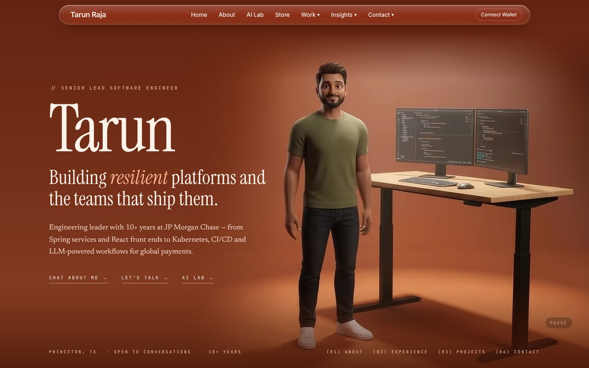
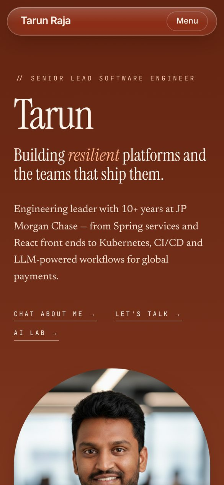
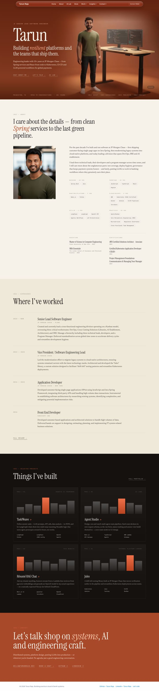
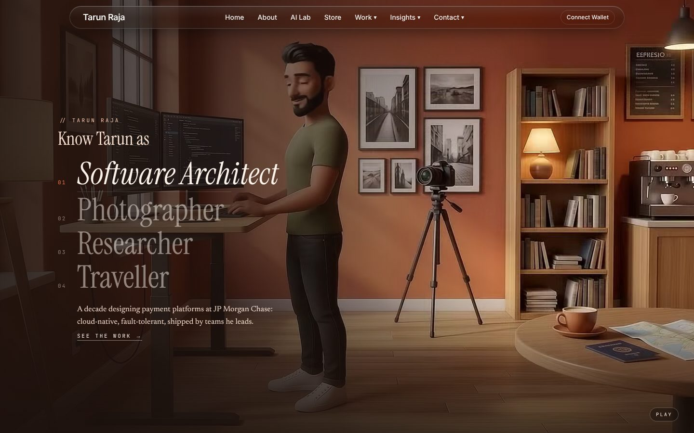
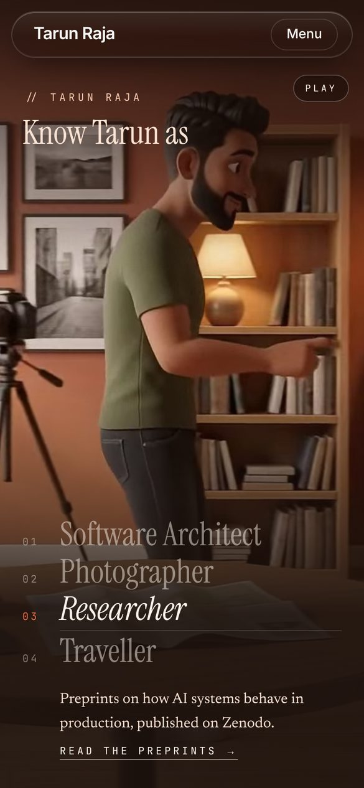
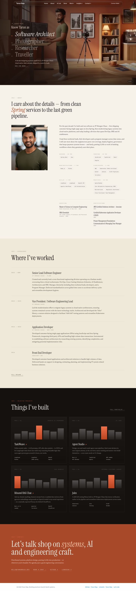
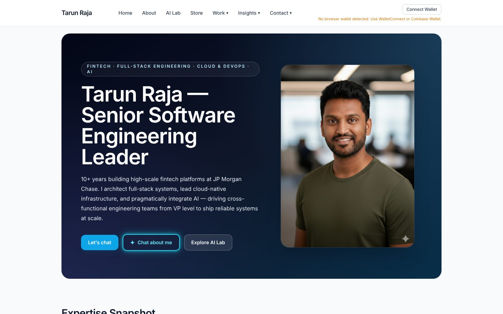
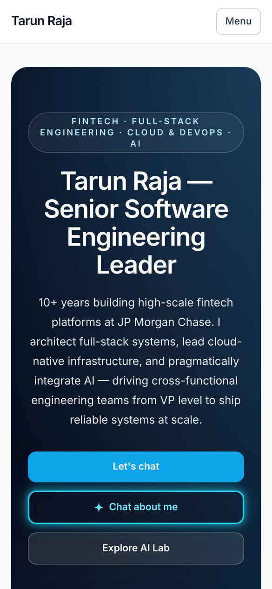
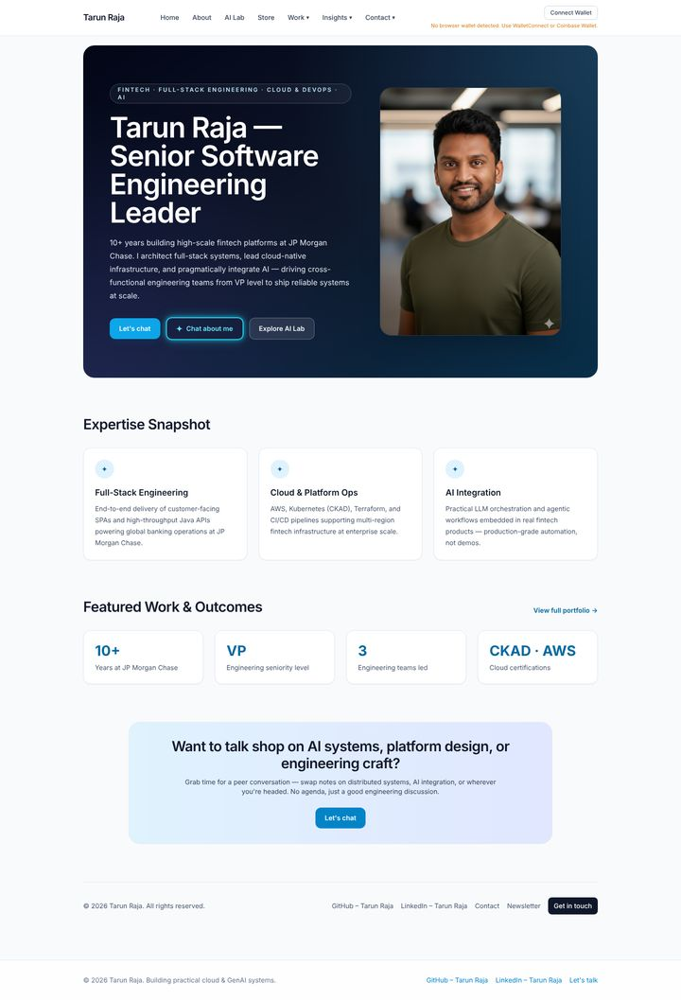

# Homepage designs

The homepage at `/` can be any of the designs below. Which one is live is
chosen in the admin UI and takes effect on the next page load, with no redeploy.

| Design | Flag value | In one line |
|--------|------------|-------------|
| [Terracotta](#terracotta) | `terracotta` | **Default.** Editorial: terracotta hero with the animated desk scene, glass nav |
| [Midnight](#midnight) | `midnight` | The original: dark navy gradient hero card with portrait and expertise cards |
| [Prism](#prism) | `prism` | "Know Tarun as…": the avatar walks desk → camera → books → café; Software Architect, Photographer, Researcher, Traveller |

## How to switch

**Admin → Content → Settings → Homepage design.** Pick a design and press
**Make … live**. It saves through the content API (`PATCH /admin/settings` in
rajatarun/ai-content-orchestrator, behind the API key and wallet sign-in), and
the homepage reads it from `GET /site/settings` on every load.

**Preview without saving:** `/?home=<flag value>` (for example `/?home=midnight`)
shows that design in that tab only. Each card in the admin picker links to it.

**Fallback:** `NEXT_PUBLIC_HOME_VARIANT` (a build-time env var, default
`terracotta`) is used only when nothing has been saved or the content API
can't be reached. Unknown names fall back to `terracotta`.

How it avoids a flash: every design is in the homepage HTML. A script in the
page `<head>` (`lib/homeDesignBoot.ts`) picks the design this browser last
saw before anything paints, and CSS shows only that design and its nav.
`components/home/HomeDesignSync.tsx` then applies the saved setting. Only a
visitor's first load after a change shows the old design briefly. The hero
video waits for the saved setting, so a design about to be swapped out never
starts downloading it.

## Adding a design

1. Build it as a component under `components/home/<name>/`.
2. Add it to `HOME_DESIGNS` in `lib/featureFlags.ts`: name, label, summary,
   thumbnail and which nav it uses (`standard` or `glass`). The admin picker
   lists whatever is there.
3. Add it to the `homes` record in `app/page.tsx`. That record is typed over
   every design, so skipping this step fails `npm run typecheck`.
4. Add a 640×400 thumbnail at `public/home-designs/<name>.jpg` and a section
   here with screenshots (desktop 1440×900, full page, and mobile 390×844),
   taken with `/?home=<name>`.

The content API only checks a name's shape, so a new design needs no backend
change.

---

## Terracotta

**Flag value:** `terracotta` (default) · **Code:** `components/home/terracotta/`

An editorial portfolio in the style of a designer's showreel. It uses serif
display type (Instrument Serif) with monospace labels (JetBrains Mono).

- **Hero:** full-bleed terracotta. On desktop (1280px and wider), a looping
  3D-animated video of Tarun at his standing desk, gesturing to the monitors.
  Narrower screens show the portrait photo instead and never download the
  video. The video has a Pause button and stays still for visitors who prefer
  reduced motion.
- **Nav:** a floating liquid-glass pill whose tint follows the section beneath
  it (clear over the hero, frosted over light sections, smoky over dark ones).
  This changes `TopNav` on the homepage only.
- **Sections:** (01) About with skills, education and certifications;
  (02) "Where I've worked" timeline; (03) "Things I've built", a dark project
  grid with animated bar charts; (04) Contact.
- Skills, timeline, education and certifications come from `data/resume.json`.

| Desktop | Mobile |
|---------|--------|
|  |  |

Full page, desktop

## Prism

**Flag value:** `prism` · **Code:** `components/home/prism/` · **Preview:** `/?home=prism`

One person, four sides. A full-screen landing reads "Know Tarun as", over a
video of the avatar walking through one long loft: from his standing desk,
past his camera on its tripod, past the bookshelf (he reaches for a book), to
a café table with a coffee.

- **The four stops** are Software Architect, Photographer, Researcher and Traveller,
  in the order he walks past them. The one he is at lights up as he reaches
  it, with a line showing progress through that stop. Tapping one jumps the
  walk there; while paused it shows that stop's still.
- **Where they lead:** Software Architect → the About / Experience / Projects /
  Contact sections below (shared with terracotta); Researcher →
  `/publications`. Photographer and Traveller say "coming soon" until those
  pages exist. All of this, and the timings, live in `lib/prismStations.ts`
  (tested in `__tests__/prismStations.test.ts`).
- **Video:** `public/prism/walk-{landscape,portrait}.{webm,mp4}`: one 8s Flow
  render, looped by dipping to dark at the join. Portrait screens get a
  9:16 cut cropped around him, landscape the full frame; turning the phone
  swaps the file and keeps the place in the walk. Each screen downloads only
  its own poster and video (about 1.3 MB landscape, 0.8 MB portrait), and
  nothing while prism is not the live design. Reduced motion gets the still,
  and there is always a Pause button.
- Uses the glass nav, tinted dark over the video.

| Desktop | Mobile |
|---------|--------|
|  |  |

Full page, desktop

## Midnight

**Flag value:** `midnight` · **Code:** `components/home/midnight/`

The homepage as it was before the editorial redesign.

- **Hero:** a rounded dark navy-to-sky gradient card with the headline
  "Tarun Raja — Senior Software Engineering Leader", the portrait, and
  "Let's chat", "Chat about me" and "Explore AI Lab" buttons.
- **Sections:** Expertise Snapshot (three cards), Featured Work & Outcomes
  (four metric tiles), a "Let's chat" call to action, and a footer row.
- Uses the standard site nav bar.

| Desktop | Mobile |
|---------|--------|
|  |  |

Full page, desktop

